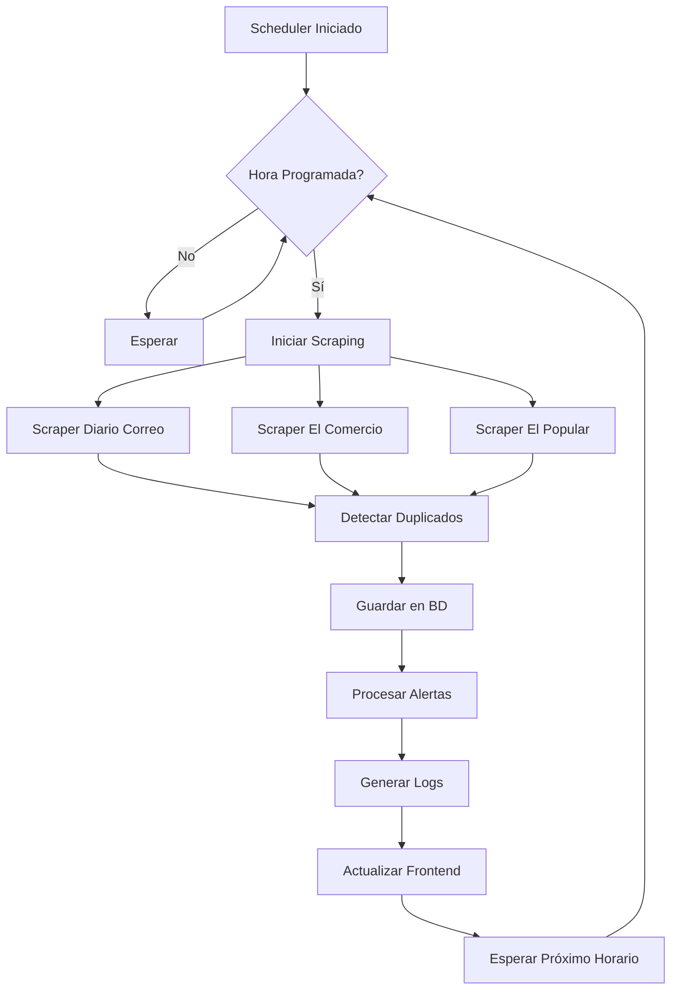

# 🤖 Sistema de Automatización Avanzado para Scraping de Diarios

## 📋 Descripción

Este sistema automatizado mejora significativamente tu scraping manual con las siguientes características:

### ✨ Características Principales

- **🕒 Programación por Horarios**: Ejecuta scraping en horarios específicos (ej: 6:00, 9:00, 12:00, etc.)
- **🔄 Reintentos Automáticos**: Sistema robusto que reintenta en caso de fallos
- **🚨 Detección de Duplicados**: Evita guardar noticias repetidas
- **📊 Monitoreo en Tiempo Real**: Visualiza el estado del sistema
- **📝 Logging Detallado**: Registros completos para debugging
- **⚡ Recuperación Automática**: Se recupera de errores sin intervención manual
- **🔧 Configuración Flexible**: Personaliza horarios y parámetros fácilmente

---

## 🚀 Instalación y Configuración

### 1. Requisitos Previos

Asegúrate de tener instalado:
- Python 3.8+
- Node.js 16+
- PostgreSQL (configurado)
- Dependencias del proyecto (`pip install -r requirements.txt`)

### 2. Configuración Inicial

```bash
# 1. Configurar el scheduler
python configure_scheduler.py

# 2. Verificar la configuración
python monitor_system.py
```

### 3. Archivos de Configuración

El sistema utiliza `scheduler_config.json` para la configuración:

```json
{
  "scraping_hours": [6, 9, 12, 15, 18, 21],  // Horarios de ejecución
  "max_retries": 3,                           // Reintentos máximos
  "retry_delay_minutes": 5,                   // Delay entre reintentos
  "log_level": "INFO",                        // Nivel de logging
  "enable_notifications": true                // Notificaciones
}
```

---

## 🎮 Uso del Sistema

### Opción 1: Sistema Completo (Recomendado)

```bash
# Inicia Backend + Scheduler + Frontend con monitoreo
python start_advanced_system.py
```

### Opción 2: Solo Scheduler

```bash
# Solo el scheduler automático
cd scheduler
python advanced_scheduler.py
```

### Opción 3: Monitoreo

```bash
# Ver estado actual
python monitor_system.py

# Monitoreo continuo cada 5 minutos
python monitor_system.py --continuous 5

# Guardar reporte
python monitor_system.py --save
```

---

## ⚙️ Configuración Avanzada

### 🕒 Configurar Horarios

Usa el configurador interactivo:

```bash
python configure_scheduler.py
```

**Opciones de horarios predefinidos:**
- **Muy Frecuente**: Cada 2 horas (6:00, 8:00, 10:00, ...)
- **Frecuente**: Cada 3 horas (6:00, 9:00, 12:00, 15:00, 18:00, 21:00)
- **Moderado**: Cada 4 horas (6:00, 10:00, 14:00, 18:00, 22:00)
- **Espaciado**: Cada 6 horas (6:00, 12:00, 18:00)
- **Personalizado**: Define tus propios horarios

### 🔧 Parámetros Importantes

| Parámetro | Descripción | Valor Recomendado |
|-----------|-------------|-------------------|
| `scraping_hours` | Horas de ejecución (0-23) | `[6, 9, 12, 15, 18, 21]` |
| `max_retries` | Reintentos en caso de fallo | `3` |
| `retry_delay_minutes` | Minutos entre reintentos | `5` |
| `scraping_timeout` | Timeout en segundos | `600` (10 min) |
| `emergency_stop_after_failures` | Parar tras N fallos | `10` |

---

## 📊 Monitoreo y Logs

### 📝 Archivos de Log

Los logs se guardan automáticamente en:
- `logs/scheduler_YYYYMMDD.log` - Logs del scheduler
- `system_manager.log` - Logs del sistema
- `reports/system_report_*.json` - Reportes del sistema

### 🔍 Verificar Estado

```bash
# Estado rápido
python monitor_system.py

# Información detallada
python monitor_system.py --save

# Monitoreo en tiempo real
python monitor_system.py --continuous 10
```

### 📈 Dashboard Web

Accede al dashboard en: `http://localhost:3000`

- Ver noticias en tiempo real
- Estadísticas de scraping
- Estado de los diarios
- Alertas y notificaciones

---

## 🛠️ Solución de Problemas

### ❌ Problemas Comunes

#### 1. "Backend no disponible"
```bash
# Verificar que el backend esté corriendo
curl http://localhost:8000

# Reiniciar si es necesario
cd backend
python -m uvicorn main:app --host 0.0.0.0 --port 8000
```

#### 2. "Base de datos offline"
```bash
# Verificar conexión a PostgreSQL
python -c "from backend.database import test_connection; print(test_connection())"

# Verificar configuración en backend/.env
```

#### 3. "Scheduler no ejecuta"
```bash
# Verificar configuración
cat scheduler_config.json

# Ver logs del scheduler
tail -f logs/scheduler_*.log
```

#### 4. "Demasiados duplicados"
```bash
# Limpiar duplicados existentes
python backend/duplicate_detector.py --clean

# Verificar configuración de detección
```

### 🔧 Comandos de Diagnóstico

```bash
# Test completo del sistema
python -c "
from monitor_system import SystemMonitor
monitor = SystemMonitor()
report = monitor.generate_report()
monitor.print_status_summary(report)
"

# Verificar procesos activos
python -c "
import psutil
for p in psutil.process_iter(['pid', 'name', 'cmdline']):
    if 'uvicorn' in str(p.info['cmdline']) or 'scheduler' in str(p.info['cmdline']):
        print(f'PID {p.info[\"pid\"]}: {p.info[\"name\"]} - {p.info[\"cmdline\"]}')
"
```

---

## 📚 Estructura del Sistema

```
📁 Proyecto/
├── 🤖 scheduler/
│   ├── advanced_scheduler.py      # Scheduler principal
│   └── cron_job.py               # Scheduler básico (legacy)
├── ⚙️  backend/
│   ├── main.py                   # API FastAPI
│   ├── scraping_service.py       # Servicio de scraping
│   └── models.py                 # Modelos de BD
├── 🌐 frontend/
│   └── src/                      # Aplicación React
├── 📊 logs/                      # Logs del sistema
├── 📋 reports/                   # Reportes generados
├── 🔧 scheduler_config.json      # Configuración
├── 🚀 start_advanced_system.py   # Iniciador del sistema
├── 🔧 configure_scheduler.py     # Configurador interactivo
└── 📊 monitor_system.py          # Monitor del sistema
```

---

## 🔄 Flujo de Trabajo Automatizado



---

## 📈 Métricas y Estadísticas

El sistema rastrea automáticamente:

- **📰 Noticias extraídas por día/hora**
- **🔍 Duplicados detectados**
- **⏱️ Tiempo de ejecución por scraping**
- **❌ Errores y reintentos**
- **🚨 Alertas activadas**
- **💾 Uso de recursos del sistema**

### Ver Estadísticas

```bash
# Estadísticas rápidas
curl http://localhost:8000/comparativa

# Estadísticas detalladas
curl http://localhost:8000/analytics/sentimientos

# Últimas ejecuciones
python -c "
from backend.database import get_db
from backend.models import EstadisticaScraping
db = next(get_db())
stats = db.query(EstadisticaScraping).order_by(EstadisticaScraping.fecha_scraping.desc()).limit(5).all()
for s in stats:
    print(f'{s.fecha_scraping}: {s.cantidad_noticias} noticias en {s.duracion_segundos}s')
"
```

---

## 🎯 Mejoras Implementadas vs Sistema Manual

| Aspecto | Sistema Manual | Sistema Automatizado |
|---------|----------------|----------------------|
| **Ejecución** | Manual, cuando recuerdes | Automática en horarios fijos |
| **Duplicados** | Posibles duplicados | Detección avanzada automática |
| **Errores** | Fallas detienen todo | Reintentos automáticos |
| **Monitoreo** | Sin visibilidad | Dashboard y logs detallados |
| **Configuración** | Código hardcodeado | Configuración flexible JSON |
| **Recuperación** | Manual | Automática con fallbacks |
| **Notificaciones** | Ninguna | Alertas configurables |
| **Estadísticas** | Básicas | Métricas completas |

---

## 🆘 Soporte y Mantenimiento

### Mantenimiento Automático

El sistema incluye:
- ✅ Limpieza automática de logs antiguos
- ✅ Rotación de archivos de log
- ✅ Detección de memoria y espacio en disco
- ✅ Parada de emergencia en caso de fallos críticos

### Actualizaciones

```bash
# Actualizar configuración sin reiniciar
python configure_scheduler.py

# Reiniciar solo el scheduler
pkill -f "advanced_scheduler.py"
cd scheduler && python advanced_scheduler.py &

# Backup de la base de datos
pg_dump tu_base_datos > backup_$(date +%Y%m%d).sql
```

---

## 🎉 ¡Listo para Usar!

1. **Configura una vez**: `python configure_scheduler.py`
2. **Inicia el sistema**: `python start_advanced_system.py`
3. **Monitorea**: `python monitor_system.py --continuous 10`
4. **Disfruta**: Tu sistema ahora extrae noticias automáticamente 🚀

### 📞 ¿Necesitas Ayuda?

Si tienes problemas:
1. Revisa los logs en `logs/`
2. Ejecuta `python monitor_system.py` para diagnóstico
3. Verifica la configuración en `scheduler_config.json`
4. Usa `python configure_scheduler.py` para reconfigurar

---

**¡Tu sistema de scraping ahora funciona 24/7 sin intervención manual!** 🎯
